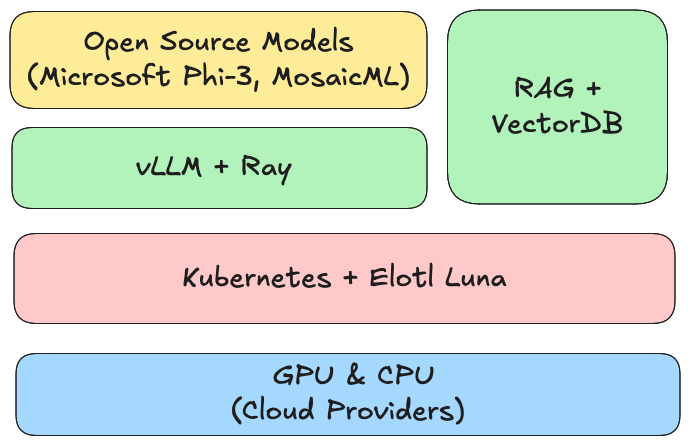
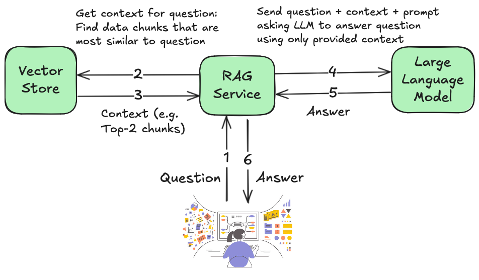

# Question-Answer Chatbot with Self-hosted LLMs & RAG

- Setup the complete infrastructure stack for a Question-Answer chatbot for your private data in just a few minutes!
- Your stack will be powered by Self-hosted Open-Source Large Language Models and Retrieval Augmented Generation running on Kubernetes Cloud clusters.

## Overview

The Question-Answer Chatbot is powered by these technologies:

1. Open-Source [Large Language Models](https://en.wikipedia.org/wiki/Large_language_model)
2. [Retrieval Augmented Generation (RAG)](https://en.wikipedia.org/wiki/Retrieval-augmented_generation)
3. [Vector Stores](https://en.wikipedia.org/wiki/Vector_database)
4. [Ray AI/ML compute framework](https://www.ray.io/)
5. [Elotl Luna](https://www.elotl.co/luna.html)

## Retrieval Augmented Generation

The graphic below shows how RAG is used to determine an answer to the end-user's question about a specific knowledge base.

## Installation

* [Cluster Setup Summary](docs/install.md#cluster-setup-summary)
* [Install Infrastructure Tools](docs/install.md#install-infrastructure-tools)
* [Install Model Serve Stack](docs/install.md#install-model-serve-stack)
* [Model Serving](docs/install.md#model-serve)
* [Retrieval Augmented Generation using FAISS](docs/install.md#retrieval-augmented-generation-rag-using-faiss)
* [Creation of the Vector Store](docs/install.md#creation-of-the-vector-store)
* [Install the RAG & LLM querying service](docs/install.md#setup-rag--llm-service)
* [Send a question to your LLM with RAG](docs/install.md#query-the-llm-with-rag)
* [Query your LLM with RAG using a Chat UI](docs/install.md#query-the-llm-with-rag-using-a-chat-ui)
* [Uninstall](docs/install.md#uninstall)

Jump to complete install doc available [here](docs/install.md).

