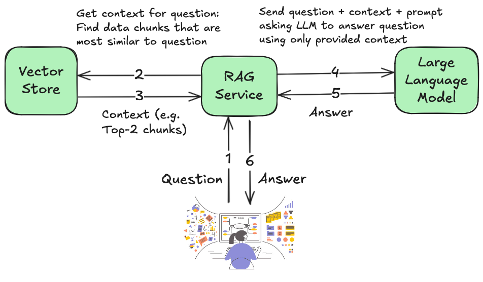

# End-User Overview of Elotl's Question-Answer ChatBot

Elotl's Question-Answer ChatBot is powered by these technologies:

1. [Retrieval Augmented Generation (RAG)](https://en.wikipedia.org/wiki/Retrieval-augmented_generation)
2. Open-Source [Large Language Models](https://en.wikipedia.org/wiki/Large_language_model)
3. [Vector Stores](https://en.wikipedia.org/wiki/Vector_database)

This is a high-level graphic on how these technologies are used to determine an answer to the end-user's question about a specific knowledge base.

<center>

</center>

## What types of questions can a RAG-based Chatbot answer well?

- Question-Answering Chatbots powered by RAG & LLMs are good at answering questions about a small subset of relevant data from the given 
Knowledge Base. This is because of how Retrieval Augmented Generation works: User questions are first matched to "chunks" of data from 
the user's Knowledge Base, that has been stored in a VectorStore or Vector Database. The user's question, along with these retrieved matching 
chunks are sent to the LLM with an appropriate the system prompt. This prompt instructs the LLM to answer the question using the context retrieved
from the specialized knowledge base.

- Let's take for example, a Question-Answer Chatbot working with an engineering team's JIRA ticket Knowledge base. Here are some sample questions
that can be answered well:

```sh
What was the issue with the Apache Airflow installation?
What type of security issues have been handled? 
Were the SQL issues resolved for the ENG team?
Were any Kubernetes upgrades initiated on the cloud? 
Can you give the description of any upgrade requests that have been received? 
```

## What types of questions is a RAG-based ChatBot not designed to answer well?

The RAG technique is not intended to answer knowledge aggregation questions about a large amount of data from a Knowledge Base.

```sh
What is the most frequent Kubernetes issue? 
Can you summarize all the recent upgrade tasks?
Can you find the ticket that's been unresolved for the longest time?
```

Let's look into one of these questions in detail to understand why the RAG technique and input token limits of LLMs make it difficult for a 
RAG-based Question-Answering ChatBot to answer well.

```sh
What is the most frequent Kubernetes issue? 
```

A question like this requires access to all Kubernetes-related tickets in the JIRA knowledge base to be able to accurately determine which one
is the most frequent. Depending on the specific dataset used to create the Vector store/DB, the number of Kubernetes related tickets could be a 
couple to many hundreds. In the former case, i.e there are only 2 Kubernetes related tickets, then a top-K similarity search during the Vector 
store retrieval step would be able to pass all the necessary context to the LLM to answer this question accurately. In the latter case,
i.e. if there are many hundreds of Kubernetes-related tickets, then the RAG service would not be able to pass all of this context to the LLM
to answer the question accurately. The reason for not being able to send a large context is because LLMs are limited by the incoming token length
they are able to process.

